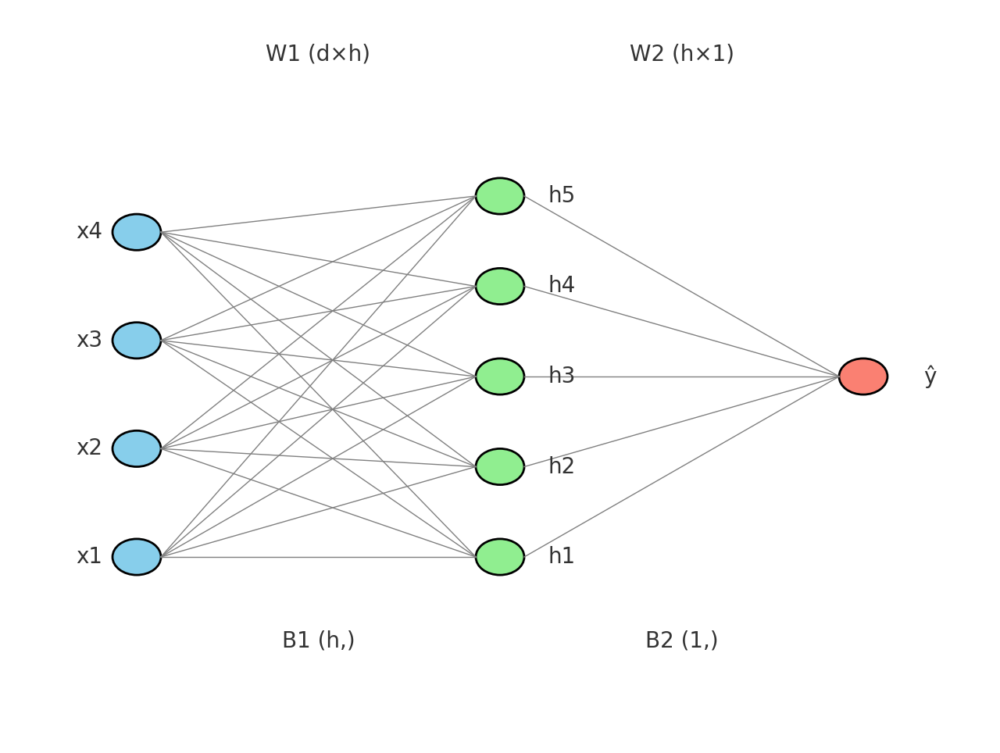

# SmartGrid Simulator
## Introduction
This project is a comprehensive simulation of a smart energy grid written in Go. It models energy sources, storage, and consumers, and implements various scheduling algorithms to manage energy requests. The application also includes modules for applying machine learning (for forecasting and clustering) and reinforcement learning (for optimizing scheduling policies).


## Key Features
### Core Simulation 
- **Energy Source Modeling** : Renewable (solar) and non-renewable (grid) energy sources with configurable capacity and failure probabilities

- **Battery Storage** : Realistic battery system with charge/discharge rates and efficiency factors

- **Consumer Modeling** : Multiple consumer types with different priorities, weights, and consumption patterns

- **Time-Step Simulation** : Configurable time resolution for accurate energy flow modeling

### Scheduling Algorithms
- **FIFO** : Processes requests in arrival order

- **NPPS** : Prioritizes higher-priority requests

- **WRR** : Distributes energy based on consumer weights

- **EDF** :  Prioritizes requests with closest deadlines

- **HYBRID** : Adaptive combinations of the above approaches based on different conditions

### Machine Learning Integration 
- **Energy Forecasting**: Linear Regression, Random Forest, and Neural Network models for demand prediction

- **Consumer Clustering**: K-Means and DBSCAN algorithms for grouping consumers by usage patterns

- **Real-time Adaptation**: ML models integrated into the simulation for dynamic adjustment

### Monitoring & Analytics
- **Prometheus Metrics** : Real-time monitoring of key performance indicators

- **Grafana Dashboards** : Visualizations for simulation metrics and results


## Installation & Configuration
### Insatlltion
first you need docker installed (for grafana and prometheus but it doesn't effect the program execution)
use this command to isntall required golang libraries : 
```
go mod tidy
```
### Commands
If you want Grafana to work , first run 
```
docker-compose up --build
```
and for Interactive CLI run :
```
go run main.go
```
for more info use :
```
help 
```

### Configuration
The simulation can be configured through a JSON configuration file or via CLI commands. Key parameters include:
- **Time Settings**: Simulation duration, time step resolution

- **Energy Sources**: Capacity, efficiency, failure probabilities

- **Battery System**: Capacity, charge/discharge rates, efficiency

- **Consumer Models**: Priorities, weights, consumption patterns

- **Scheduling Parameters**: Algorithm-specific settings


## Code Structure

### Neural Network Model :
- **2-layer architecture with configurable hidden units**

- **Adam optimization for efficient training**

- **ReLU activation functions**

- **Support for regression and classification tasks**
```
EnergyPredictor *MLP
EnergyPredictor = NewMLP(24, 16, rand.New(rand.NewSource(42)))
```


### Reinforcement Learning : 
- **Q-Learning implementation for policy optimization**

- **State discretization for efficient learning**

- **Reward function based on wait times, completion rates, and energy efficiency**